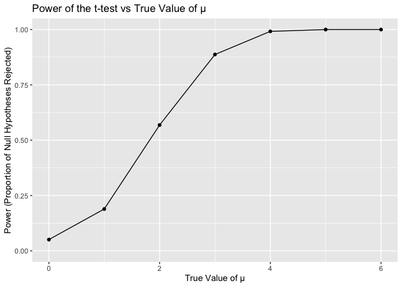
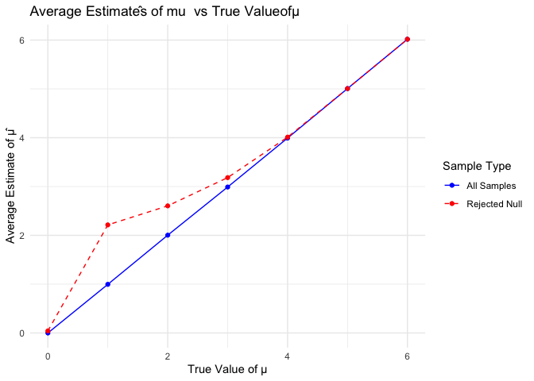
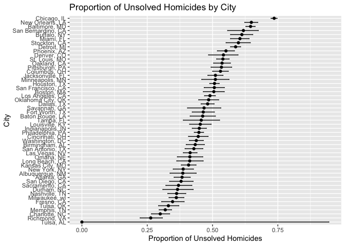

p8105_hw5_yc4585
================
2024-11-15

``` r
library(broom)
library(ggplot2)
library(tidyr)
library(dplyr)
library(purrr)
```

# Problem 2

## set functions

``` r
set.seed(1)
sim_mean_p = function(n = 30, mu, sigma = 5) {
  
  sim_data = tibble(
    x = rnorm(n, mean = mu, sd = sigma)  
  )
  
  test_result = t.test(sim_data$x, mu = 0)  
  tidy_result = broom::tidy(test_result)  
  
  return(tibble(
    mu_hat = mean(sim_data$x),
    p_value = tidy_result$p.value
  ))
}
```

## Test of H: mu=0

``` r
sim_results_df = 
  expand_grid(
    n = 30,
    mu=0,
    iter = 1:5000
  ) |> 
  mutate(
    estimate_df = map2(n,mu,sim_mean_p)
  ) |> 
  unnest(estimate_df)

sim_results_df
```

    ## # A tibble: 5,000 × 5
    ##        n    mu  iter mu_hat p_value
    ##    <dbl> <dbl> <int>  <dbl>   <dbl>
    ##  1    30     0     1  0.412  0.629 
    ##  2    30     0     2  0.664  0.368 
    ##  3    30     0     3  0.551  0.534 
    ##  4    30     0     4  0.567  0.487 
    ##  5    30     0     5 -1.65   0.0599
    ##  6    30     0     6  1.19   0.229 
    ##  7    30     0     7  0.334  0.738 
    ##  8    30     0     8 -1.19   0.209 
    ##  9    30     0     9  0.122  0.887 
    ## 10    30     0    10  0.684  0.472 
    ## # ℹ 4,990 more rows

## Test of H: mu={1,2,3,4,5,6}

``` r
sim_multi_results_df = 
  expand_grid(
    n=30,
    mu = c(1,2,3,4,5,6),
    iter = 1:5000
  ) |> 
  mutate(
    estimate_df = map2(n,mu,sim_mean_p)
  ) |> 
  unnest(estimate_df)

sim_multi_results_df
```

    ## # A tibble: 30,000 × 5
    ##        n    mu  iter mu_hat p_value
    ##    <dbl> <dbl> <int>  <dbl>   <dbl>
    ##  1    30     1     1  1.52   0.0865
    ##  2    30     1     2  2.11   0.0159
    ##  3    30     1     3  2.01   0.0183
    ##  4    30     1     4  0.165  0.839 
    ##  5    30     1     5  0.108  0.912 
    ##  6    30     1     6  1.56   0.0682
    ##  7    30     1     7  2.04   0.0252
    ##  8    30     1     8  2.40   0.0154
    ##  9    30     1     9  2.15   0.0154
    ## 10    30     1    10  0.500  0.634 
    ## # ℹ 29,990 more rows

## Plot of Power of the t-test vs True Value of μ

``` r
results_df <- bind_rows(sim_results_df,sim_multi_results_df)  
  power_data=
    results_df |>
    group_by(mu) |>
    summarise(power=mean(p_value<0.05))

power_plot=
  ggplot(power_data, aes(x = mu, y = power)) +
  geom_line() +
  geom_point() +
  labs(title = "Power of the t-test vs True Value of μ",
       x = "True Value of μ",
       y = "Power (Proportion of Null Hypotheses Rejected)") +
  ylim(0,1)

power_plot
```

<!-- -->

The relationship between the true value of mu and the power of the test
is positively proportional. Since Power is the probability of correctly
rejecting the null hypothesis when the alternative hypothesis is true. A
larger effect size (in our case, true value of mu) makes it easier to
detect the effect, leading to higher power. From the plot we can see: as
the true value of mu increases, the power of the test also increases.
When the true value of mu is relatively small, the power increases
rapidly. However, once the true value of mu approaches 4, the increase
becomes more gradual, asymptotically approaching 1. \## plot of average
mu hat vs true value of mu

``` r
average_results = 
  results_df |>
  group_by(mu) |>
  summarise(
    average_mu_hat=mean(mu_hat)
  ) 

p_results = 
  results_df |>
  filter(p_value<0.05) |>
  group_by(mu) |>
  summarise(
    average_mu_hat_rejected=mean(mu_hat)
  ) 

average_plot=
    ggplot(data=average_results) +
      geom_line(data = average_results, aes(x = mu, y = average_mu_hat, color = "All Samples")) +
      geom_point(data = average_results, aes(x = mu, y = average_mu_hat, color = "All Samples")) +
      geom_line(data = p_results, aes(x = mu, y = average_mu_hat_rejected, color = "Rejected Null"),  linetype = "dashed") +
      geom_point(data = p_results, aes(x = mu, y = average_mu_hat_rejected, color = "Rejected Null")) +
      labs(title = "Average Estimatês of mu  vs True Valueofμ",
           x = "True Value of μ",
           y = "Average Estimate of μ̂") +
      scale_color_manual(name = "Sample Type", 
                         values = c("All Samples" = "blue", "Rejected Null" = "red")) +
      theme_minimal()

average_plot
```

<!-- -->
Yes, the sample average of mu across test for which the null is rejected
approximately does not equal to the true value of mu,especially in the
cases where the true value of mu equals to 1 and 2, which could be
because of selection bias.

# Problem3

## Import and clean data

``` r
homicide_data=read.csv("./homicide-data.csv")

add_data =
  homicide_data |>
  mutate(city_state = paste(city, state, sep = ", ")) |>
  group_by(city_state) |>
  summarize(
    total_homicides = n(),
    unsolved_homicides = sum(disposition %in% c("Closed without arrest", "Open/No arrest"))
  )
```

In the raw data of homicides in 50 large U.S. cities, there are 52,179
observations and 12 columns. The columns include the unique identifier
(UID) of each crime, the reported date of the crime, the victim’s first
and last name, their race, age, and sex. Additionally, the dataset
contains information about the city and state where the crime occurred,
the latitude and longitude, and the disposition of the case. \##
Proportion of unsolved homicides in Baltimore, MD

``` r
MD_data = 
  add_data |>
  filter(city_state=="Baltimore, MD")

prop_test_result <- prop.test(x = MD_data$unsolved_homicides, 
                              n = MD_data$total_homicides)

tidy_result <- broom::tidy(prop_test_result)

estimated_proportion <- tidy_result |> pull(estimate)
conf_low <- tidy_result |> pull(conf.low)
conf_high <- tidy_result |> pull(conf.high)

list(
  estimated_proportion = estimated_proportion,
  conf_low = conf_low,
  conf_high = conf_high
)
```

    ## $estimated_proportion
    ##         p 
    ## 0.6455607 
    ## 
    ## $conf_low
    ## [1] 0.6275625
    ## 
    ## $conf_high
    ## [1] 0.6631599

## Proportion of unsolved homicides in each city

``` r
run_prop_test <- function(unsolved, total) {
  prop_test_result <- prop.test(x = unsolved, n = total, correct = TRUE)
  tidy_result <- broom::tidy(prop_test_result)
  return(tidy_result)
}

all_city = add_data |>
  mutate(
    test_results = map2(unsolved_homicides, total_homicides, run_prop_test)
  ) |>
  unnest(test_results) |>
  mutate(
  confidence_interval = paste(conf.low, "-", conf.high))|>
  select(city_state, total_homicides, unsolved_homicides, estimate,confidence_interval, conf.low, conf.high)
```

    ## Warning: There was 1 warning in `mutate()`.
    ## ℹ In argument: `test_results = map2(unsolved_homicides, total_homicides,
    ##   run_prop_test)`.
    ## Caused by warning in `prop.test()`:
    ## ! Chi-squared approximation may be incorrect

``` r
all_city
```

    ## # A tibble: 51 × 7
    ##    city_state    total_homicides unsolved_homicides estimate confidence_interval
    ##    <chr>                   <int>              <int>    <dbl> <chr>              
    ##  1 Albuquerque,…             378                146    0.386 0.337260384254284 …
    ##  2 Atlanta, GA               973                373    0.383 0.352811897036302 …
    ##  3 Baltimore, MD            2827               1825    0.646 0.627562457662644 …
    ##  4 Baton Rouge,…             424                196    0.462 0.414198741860307 …
    ##  5 Birmingham, …             800                347    0.434 0.399188948632167 …
    ##  6 Boston, MA                614                310    0.505 0.464621930200304 …
    ##  7 Buffalo, NY               521                319    0.612 0.568798964634228 …
    ##  8 Charlotte, NC             687                206    0.300 0.26608198188312 -…
    ##  9 Chicago, IL              5535               4073    0.736 0.723995888425454 …
    ## 10 Cincinnati, …             694                309    0.445 0.407960574220688 …
    ## # ℹ 41 more rows
    ## # ℹ 2 more variables: conf.low <dbl>, conf.high <dbl>

## Plot of the estimates and CIs for each city

``` r
all_city_plot=
ggplot(all_city, aes(x = reorder(city_state, estimate), 
                   y = estimate, 
                   ymin = conf.low, 
                   ymax = conf.high)) +
  geom_point() +  # Plot the estimate as a point
  geom_errorbar(width = 0.2) +  # Add error bars for the confidence intervals
  coord_flip() +  # Flip the coordinates to make the plot horizontal
  labs(
    x = "City", 
    y = "Proportion of Unsolved Homicides",
    title = "Proportion of Unsolved Homicides by City"
  ) 

all_city_plot
```

<!-- -->
